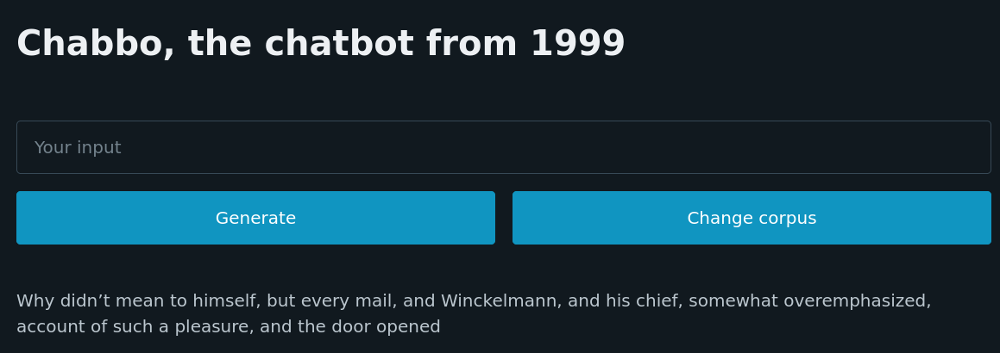

 

# Chabbo

Chabbo replying to the prompt "Why", trained on The Picture of Dorian
Gray

A chatbot for people who are tired of sophisticated AI like ChatGPT and would
rather talk to an inane, nonsensical bot trained on their own choice of
material.

Written to run on [Deta Space](https://deta.sh) but fully functional in local
environments. When the `DETA_PROJECT_KEY` is set, the application will use Deta
as a backend.

## Installation

`cargo install --git http://github.com/wonderfulspam/chabbo` or [install to your
Deta space](https://deta.space/discovery/@wonderfulspam/chabbo).

### Local development

Install [just](https://github.com/casey/just) to run the commands defined in the
`justfile`. Otherwise, the file serves as living documentation of the things you
can do.

## Usage

### Using your own choice of corpus

Chabbo can swap out its guts on the fly, mostly owing to the fact that
constructing a Markov chain is a couple of dozen orders of magnitude simpler
than actually training an ML model.

The default corpus is The Picture of Dorian Gray as found on [Project
Gutenberg](https://www.gutenberg.org/ebooks/174). To use a different corpus,
follow the instructions in the web UI.

### Generating corpora

A corpus should consist of line-delimited sentences without superfluous
punctuation. The `scripts/` folder contains scripts for extracting text from
Telegram and Messenger chat exports as well as for tidying up books found on
Project Gutenberg.

## Implementation

The text generation itself is a simple Markov chain. It runs as an Axum app with
a minimal amount of vanilla JS to facilitate communication +
[PicoCSS](https://picocss.com) to make the application look vaguely modern.
Communication with Deta is handled via
[wondefulspam/deta-rust](https://github.com/wonderfulspam/deta-rust), a fork of
[jnsougata/deta-rust](https://github.com/jnsougata/deta-rust).

## TODO

* [x] Be generic over file system & deta backends
* [x] Allow changing/adding corpora
* [ ] Build on Deta instead of shipping binary directly (awaiting upstream fix)
* [ ] Improve error handling to improve resilience
* [ ] Replace the trainwreck of a frontend with eg. a Svelte app

### License

Licensed under either of <a href="LICENSE-APACHE">Apache License, Version
2.0</a> or <a href="LICENSE-MIT">MIT license</a> at your option.

 

Unless you explicitly state otherwise, any contribution intentionally submitted
for inclusion in in this project by you, as defined in the Apache-2.0 license, shall be
dual licensed as above, without any additional terms or conditions.

